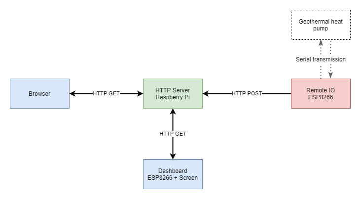
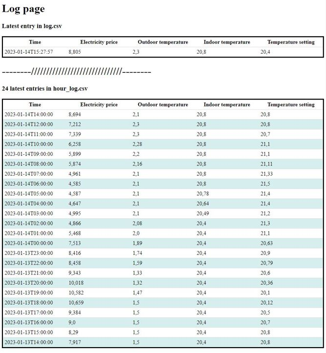
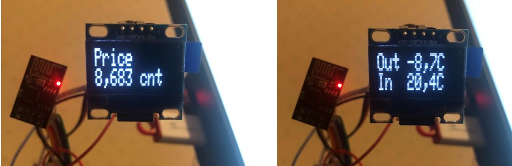

# Geothermal-project overview
Repository contains files related to a geothermal heating pump logging. First an ESP8266 microcontroller communicates with the pump and writes a heating setpoint into its registers which varies based on the current electricity price. The microcontroller then reads sensor values from the pump and sends them to a Raspberry Pi using HTTP POST. The Raspberry then logs the values for future use and displays them on a local web page. Below is a diagram of the system architecture.

### Server
Raspberry Pi is runs a HTML server in which the ESP8266 sends HTTP POSTs containing the current sensor values and heating setpoint. The HTTP POST is then parsed and the values are added onto a log files. One logfile contains all of the POST-values and the other contains hourly averages for the values. 

The server also fetches current electricity prices from the internet automatically and adds them to log files.

Below is a screenshot from the local web page that the server hosts:

Ongoing development:
  - Better web interface. Graphs and tables for better visualisation
  - Automatic electricity consumption fetching from grid operators web page

### ESP8266-dashboard
A small dashboard application which shows the current electricity price, inside temperature and outside temperature measured by the geothermal pump.

