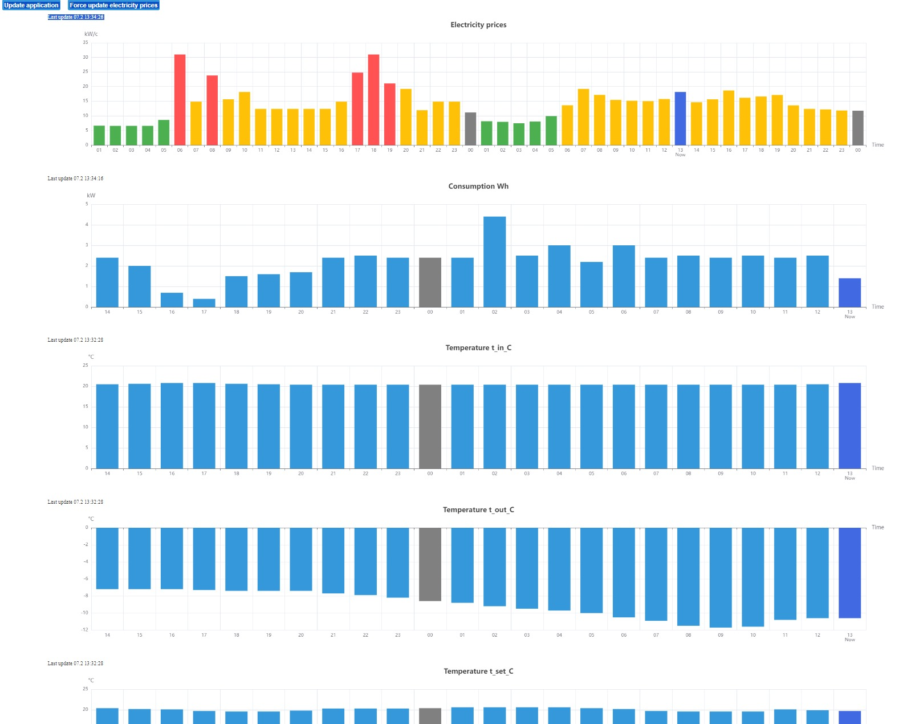

# Geothermal-project overview

Repository contains a website which logs and shows temperature data from a geothermal heat pump and electricity consumption data from a electricity-meter board. The webserver also fetches daily electricity price data from Nordpools api and displays it to the user.

Temperature data from the geothermal heat pump is obtained using an ESP32 microcontroller. The microcontroller communicates with the heat pump's service port via serial communication to read its registers.
Electricity consumption data is retrieved by monitoring an LED on the electricity-meter board, which blinks each time a Wh of electricity is consumed.

The project was developed and tested with Linux Mint 21 and run on Raspbian 11. The Python version used was 3.9.

## Features

* Data Logging: Captures and records temperature and electricity consumption data.
* Visualization: Presents the acquired data do user and the time when the data was updated.
* Easy updates: User can click a button at the website that updates the application from the repository.

### Building and running
The server uses SQLite for storing and transforming of data and Flask as a web framework. For front-end, the project uses Angular.

#### Server
SQLite3 must be installed to handle the database as well as Python library Pytz to handle timezone changing.

#### Browser
For frontend, NPM and Angular CLI must be installed in order to build the index.html and javascript files.

The frontend can be built by running the build.sh script at the root of the repository. Afterwards the server can be started by running `python3.9 server` at the server directory. When server.py is running, the site can be seen at the configured address.

--Work in progress--

